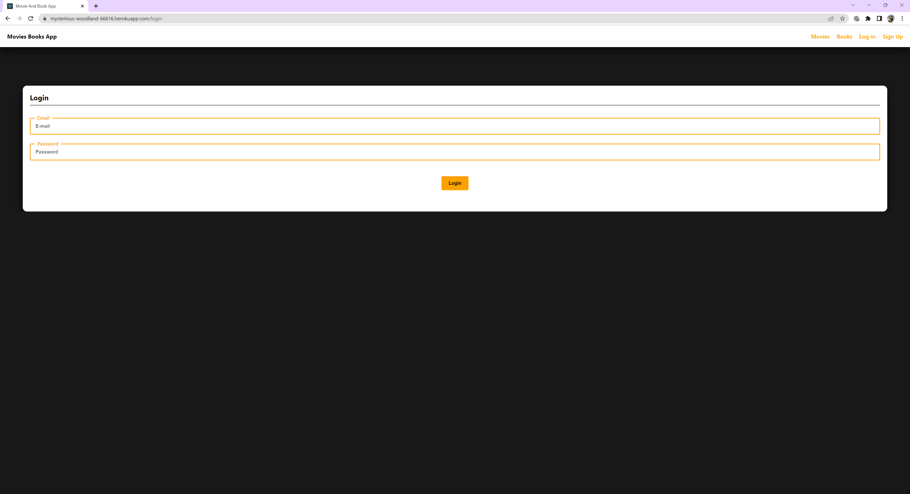
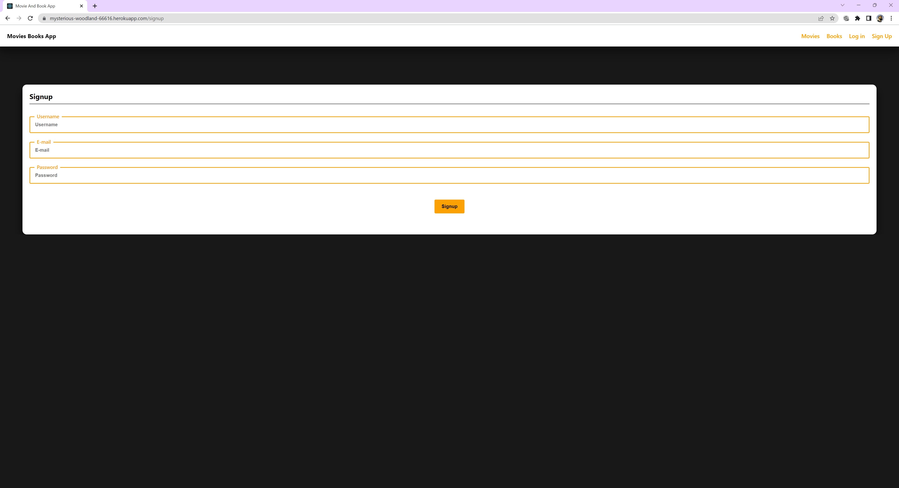

# Project-3

Between the Covers is an application designed to help users identify whether a particular book has been adapted to movie format. Users have the ability to create an account and search for their favourite titles.

## Description
We wanted to create an application that can help users identify books and their movie adaptations. Creating a user-friendly app that helps find author, date, and other information. This application uses React for the front end and GraphQL with a Node.js and Express.js server. This is a mobile friendly app!

## Deployed Site
The deployed site of the application can be accessed by <a href="https://mysterious-woodland-66616.herokuapp.com/">clicking here</a>.

## Technologies Used
* JavaScript 
* React
* Node.js
* Express
* MongoDB
* Mongoose ODM
* CSS 
* Google Books API
* OMdB Movie API

## Installation
* Node.js (npm init)

## Screenshots
 
 
 
 
 

  
  
 ## Demo
[Demo](https://drive.google.com/file/d/1W9OMpkw83PHXUX77QJTXSjay5AuE4v9d/view?usp=share_link)

## Team Members
* Ethugalge Liyanage
* Innocent Ngoy
* Ashley Pereira
* Asra Pervez
* Sam Rankin
* James Tietjen
* Daniel Yeung

## License
  
